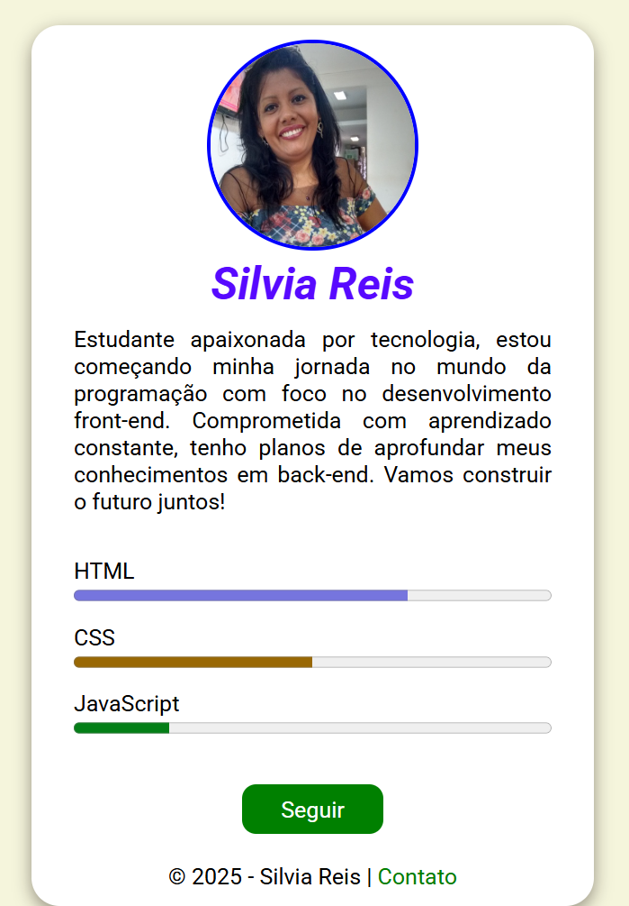

# 📝Perfil de Silvia Reis - Estudante de Front-End

Bem-vindo ao meu perfil! Eu sou **Silvia Reis**, uma estudante apaixonada por tecnologia e programação. Atualmente, estou começando minha jornada no mundo do desenvolvimento **Front-End** com o objetivo de me tornar uma desenvolvedora completa.

📚Este projeto faz parte do programa **Softex PE - Bolsa Futuro Digital**, polo **UEPA**, que visa capacitar pessoas para o mundo da tecnologia e prepará-las para o mercado de trabalho. Este perfil é um exercício prático do curso, onde estou desenvolvendo minhas habilidades em front-end.

## 👩🏽‍💻Sobre Mim

Estou comprometida com o aprendizado constante e tenho planos de expandir meus conhecimentos para o **Back-End** no futuro. Este portfólio representa minha dedicação ao estudo do desenvolvimento web e compartilha um pouco do meu progresso até agora.

### 📌**Habilidades**

Aqui estão as minhas habilidades atuais de desenvolvimento front-end:

- **HTML**: 70%
- **CSS**: 50%
- **JavaScript**: 20%

Cada uma dessas habilidades está em constante evolução, e estou sempre buscando melhorar e aprender mais!

## 🛠️Tecnologias Usadas

- **HTML5**
- **CSS3**
- **JavaScript**

## 💻Como Acessar

Você pode acessar meu portfólio online através dos seguintes links:

- **Repositório no GitHub**: [https://github.com/Silviareis1/Silviareis1](https://github.com/Silviareis1/Silviareis1)
- **Visualizar o Projeto no GitHub Pages**: [https://silviareis1.github.io/](https://silviareis2.github.io/perfil/)

## 📸Print do Projeto

Veja uma captura de tela do projeto abaixo:

  
*(Substitua o link "link-para-o-print-do-projeto.png" com o caminho real para a imagem ou o link onde o print está hospedado.)*

## 📲Contato

Caso queira entrar em contato comigo, fique à vontade para me enviar um e-mail para:

[**📧silviareis104@email.com**](mailto:silviareis104@email.com)

---
## 📜Licença

Este projeto é de autoria de **Silvia Reis** e está disponível para fins educacionais e de aprendizado.

